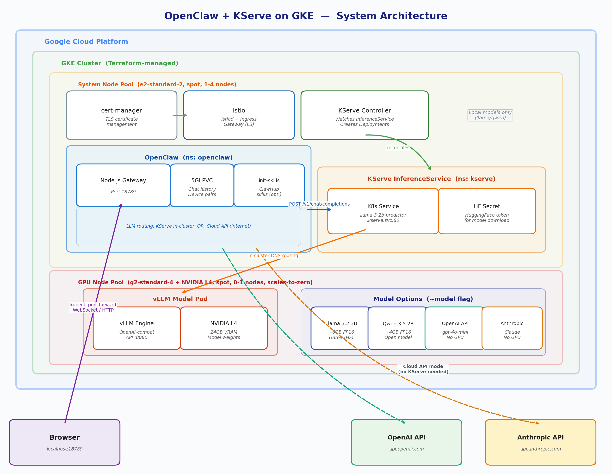

# OpenClaw + KServe on GKE

Deploy [OpenClaw](https://github.com/serhanekicii/openclaw) with a self-hosted Llama 3.2 3B model served via KServe + vLLM on a cost-optimized GKE cluster.

## Architecture



1. **OpenClaw** sends chat completion requests to the KServe in-cluster endpoint (or OpenAI API directly).
2. **KServe + vLLM** serves the model on an L4 GPU via an OpenAI-compatible API.
3. **GKE autoscaler** scales the GPU node pool to zero when idle ($0 GPU cost).

## Prerequisites

1. **GCP account** — New accounts get **$300 free credit for 90 days**
2. **CLI tools**: `gcloud`, `terraform`, `kubectl`, `helm`
3. **HuggingFace account** (for local models):
   - Accept the [Llama 3.2 3B Instruct license](https://huggingface.co/meta-llama/Llama-3.2-3B-Instruct)
   - Create an [access token](https://huggingface.co/settings/tokens) with "Read" permission

## Quick Start

```bash
# 0. Configure GCP (one-time setup, ~5 min)
chmod +x setup-gcp.sh
./setup-gcp.sh

# 1. Set HuggingFace token (or edit kserve/hf-secret.yaml directly)
export HF_TOKEN=hf_your_token_here

# 2. Deploy everything
chmod +x deploy.sh kserve/install-kserve.sh openclaw/install-openclaw.sh
./deploy.sh                         # Llama 3.2 3B (default, ~25 min)
# ./deploy.sh --model qwen            # Qwen 3.5 2B
# ./deploy.sh --model llama --skills  # Llama + ClawHub skills

# OR: Use OpenAI API (no GPU, no KServe — ~10 min)
export OPENAI_API_KEY=sk-...
./deploy.sh --model openai

# 3. Access OpenClaw
kubectl port-forward -n openclaw svc/openclaw 18789:18789
# Open http://localhost:18789/?token=<TOKEN_FROM_OUTPUT>
```

## Model Options

| Model | Flag | GPU | Deploy time |
|-------|------|-----|-------------|
| Llama 3.2 3B Instruct | `--model llama` (default) | L4 (6GB VRAM) | ~25 min |
| Qwen 3.5 2B | `--model qwen` | L4 (4GB VRAM) | ~25 min |
| OpenAI API (gpt-4o-mini) | `--model openai` | None | ~10 min |

OpenAI mode skips KServe, Istio, and cert-manager entirely — OpenClaw calls the API directly.

## Project Structure

```
.
├── deploy.sh                    # Master deployment script
├── setup-gcp.sh                 # One-time GCP project setup
├── start.sh / stop.sh           # Cost management (pause/resume)
├── terraform/                   # GKE cluster infrastructure
├── kserve/
│   ├── install-kserve.sh        # cert-manager + Istio + KServe
│   ├── hf-secret.yaml           # HuggingFace token
│   ├── llama-inferenceservice.yaml
│   └── qwen-inferenceservice.yaml
├── openclaw/
│   ├── install-openclaw.sh      # OpenClaw Helm install
│   ├── values.yaml              # Llama config
│   ├── values-qwen.yaml         # Qwen config
│   ├── values-openai.yaml       # OpenAI config
│   └── values-skills.yaml       # Skills overlay (composable)
├── helm-chart/                  # Single Helm chart (alternative)
├── argocd/                      # GitOps deployment (optional)
└── docs/                        # Detailed documentation
```

## Skills

OpenClaw supports **skills** from [ClawHub](https://clawhub.com) — installable plugins for weather, web search, etc. Skills are configured in a separate composable file:

```bash
# Deploy with skills (works with any model)
./deploy.sh --model llama --skills

# Or compose manually
bash openclaw/install-openclaw.sh --values values.yaml --values values-skills.yaml
```

Edit `openclaw/values-skills.yaml` to add/remove skill slugs. See [docs/skills.md](docs/skills.md) for details.

## Cost Management

```bash
./stop.sh              # Stop GPU only (~$0.02/hr system pool stays)
./stop.sh --all        # Stop all nodes (~$0.00/hr, control plane free)
./stop.sh --destroy    # Destroy cluster ($0.00, needs full redeploy)

./start.sh --all       # Scale nodes back up (~3-5 min)
./start.sh             # Redeploy model (~5-10 min)
```

| State | Hourly cost | Monthly (24/7) |
|-------|-------------|----------------|
| GPU running | ~$0.17 | ~$118 |
| GPU off (system pool only) | ~$0.02 | ~$15 |
| All nodes off | ~$0.00 | ~$0 |

See [docs/operations.md](docs/operations.md) for teardown options and daily workflow tips.

## Troubleshooting

| Problem | Quick fix |
|---------|-----------|
| GPU node not provisioning | Check L4 quota: `kubectl describe pod -n kserve <pod>` |
| Model download failing | Verify HF token and license acceptance |
| OpenClaw can't reach model | Check service URL matches InferenceService name |

See [docs/troubleshooting.md](docs/troubleshooting.md) for full FAQ.

## Documentation

| Guide | Description |
|-------|-------------|
| [GCP Setup](docs/gcp-setup.md) | Manual GCP configuration and time estimates |
| [Step-by-Step Deployment](docs/step-by-step.md) | Manual deployment walkthrough |
| [File Reference](docs/file-reference.md) | File-by-file explanation |
| [Skills](docs/skills.md) | ClawHub skill configuration and runtime dependencies |
| [Architecture](docs/architecture.md) | Detailed architecture diagrams and flows |
| [Helm Chart](docs/helm-chart.md) | Single Helm chart alternative to scripts |
| [ArgoCD](docs/argocd.md) | GitOps deployment with ArgoCD |
| [Operations](docs/operations.md) | Cost management, stop/start, teardown |
| [Troubleshooting](docs/troubleshooting.md) | Common issues and FAQ |
